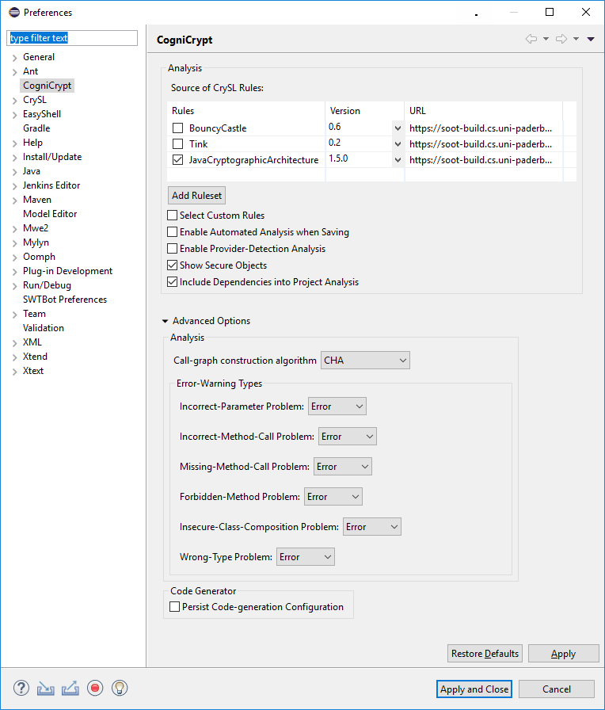

CogniCrypt comprises two features to assist in the usage of cryptographic APIs. First, its code generator CogniCryptGEN may generate code wrappers around cryptographic APIs that implement programming tasks involving cryptography. Currently, CogniCryptGEN supports code generation for five such tasks. CogniCrypt also employs a suite of static code analyses CogniCryptSAST constantly running the background and checking for misuses of cryptographic APIs. Thanks to its tight integration with Eclipse, developers are being alerted of misuses by means of regular Eclipse error markers. Both CogniCryptGEN and CogniCryptSAST are parameterized and configured by rules in the specification languge CrySL. For more details on all three, please refer to their corresponding tutorial pages:

* [CrySL - Usage Specifications for Cryptographic APIs](code-generation)

* [CogniCryptGEN - Generator for Code Examples for Cryptographic APIs](code-generation)

* [CogniCryptSAST - Analysis for Misuses of Cryptographic APIs](code-analysis)

## Configuration

Through its preference menu, CogniCrypt may be configured in several different ways. The preferences are depicted below.

    

* `Source of CrySL Rules` : Users may select in this table which CrySL rules CogniCrypt should include in its analyis and code generation. By default, there are three rule sets, one for the JCA, one for BouncyCastle, and one for Google Tink. However, users may add new ruleset through the button below the table.

* `Select Custom Rules` : As explained [here](crysl), users may write their own custom CrySL rules in CogniCrypt directly if they do not want to specify a complete rule set. For CogniCrypt to use these custom rules, a user has to enable this option here.

* `Enable Automated Analysis when Saving` : When this option is enabled, CogniCryptSAST executes whenever a source-code file is saved. Otherwise, the user has to trigger CogniCryptSAST manually

* `Enable Provider-Detection Analysis` : If enabled, CogniCryptSAST determines automatically which JCA provider is used primarily in the application under analysis and subsequently selects the appropriate  rule set. 

* `Show Secure objects` : If users wish CogniCryptSAST to inform them not just about insecure objects, but also about secure ones, they can enable this option. Secure objects are then reported in the gutter on the left in the source-code editor as info messages. 

* `Include Dependencies to Analysis` : When enabled, CogniCryptSAST not only checks the application code directly, but any library code the application code depends on.

* `Call-graph construction algorithm` : Users may select which algorithm CogniCryptSAST uses for call-graph construction.

* `Error-Warning Types` : By means of these options, users may set the severity CogniCryptSAST's error types are reported with. They may chosse between Error, Warning, Info, or Ignore.

* `Persist Code-generation Configuration` : If enabled, CogniCryptGEN stores the configuration it uses to generate code for a cryptographic use case into the root folder of the user's project.
