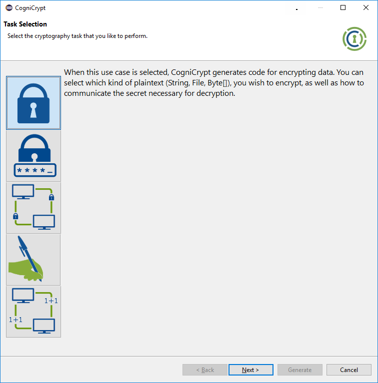
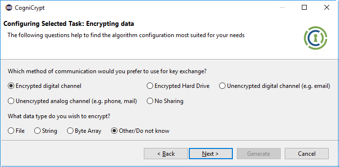
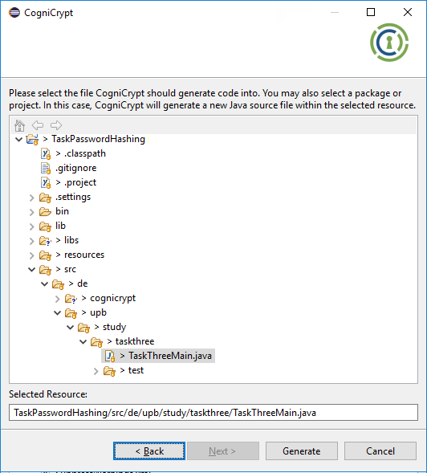

    

This tutorial page describes how one would use CogniCrypt's code-generation feature CogniCryptGEN. For a more technical description of how the code generation works in the background, please refer to the accompanying [research paper](https://karimali.ca/resources/papers/ccgen.pdf) published at CGO 2020 or [tool Paper on CogniCrypt](http://bodden.de/pubs/knr+17cognicrypt.pdf) published at ASE 2017.

# Launching the CogniCryptGEN

CogniCryptGEN can most easily be triggered by clicking the CogniCryptGEN button in the Eclipse tool bar. Another way of triggering the code generator is through opening the context menu on the respective project and select the entry "Launch CogniCrypt" as displayed in the screenshot below.

    

# Selecting a Task

When CogniCrypt launches, the following window pops up:

    

Here, the user has to select a cryptographic programming task by means of the icon buttons in the column on the left. Currently, five tasks are supported. The text box on the right shows a brief description of the task that is selecte. Once the user has selected a task they can continue.

# Configuring a Solution
For each task, CogniCrypt asks the user a number of questions. These questions help CogniCrypt configure the solution it provides the user with in the end. For the task ''Encrypt Data'' (hereafter referred to as Encryption Task), CogniCrypt needs the user to answer the questions shown in the following screenshots:

    

The first question relates to the key-transfer method the answer to which determines if CogniCryptGEN generates code for hybrid or a password-based symmetric encryption. Question 2 allows the user to specify an input type for the encryption. The default data type are byte arrays. Should the user pick any other type, the generated code takes care of the type conversion for the user.

# Selecting a Location

When the user has answered all questions, CogniCryptGEN shows one final window. In this window, the user has to select a location for where the CogniCryptGEN should generate code. The window is depicted in the screenshot below.

    

# Integrating the Solution into the Application

For the each task, CogniCryptGEN generates two code artefacts. First, there is the actual implementation. It is always generated into a package called ''de.cognicrypt.crypto''. The encryption task is rather simple and merely comprises of one class as shown below. Other tasks might be more complex and require more code, though.

    

The second artefact is a glue-code method called ''templateUsage()'' showcasing to the developer how to properly use the implementation in their application. If the user selected a Java source file in the previous screen, CogniCrypt generates the method into  this class. If not, CogniCrypt generates the method into a class Output.java, also under the ''de.cognicrypt.crypto'' package. 

    

Finally, to integrate the generated code into their application, the user may choose to simply call the ''templateUsage()'' method or copy-paste the statements from the method they need in their code to the right place. By means of its [CogniCryptSAST](../code-analysis), CogniCrypt will ensure its user does not break the security during integration.
